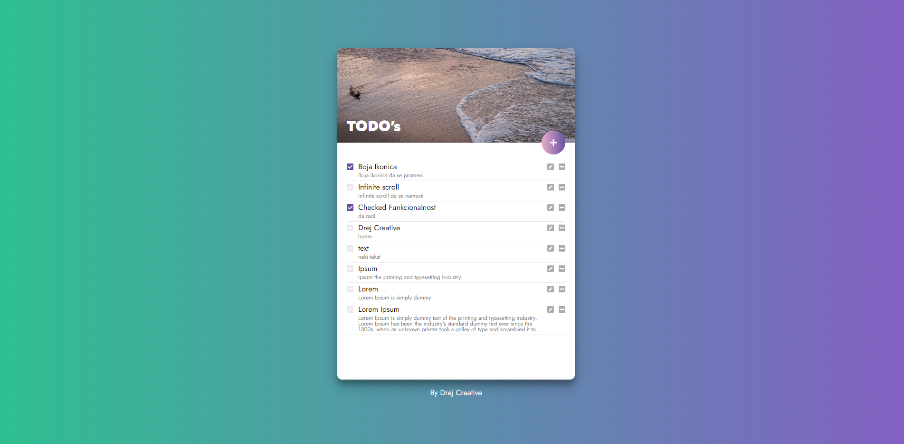
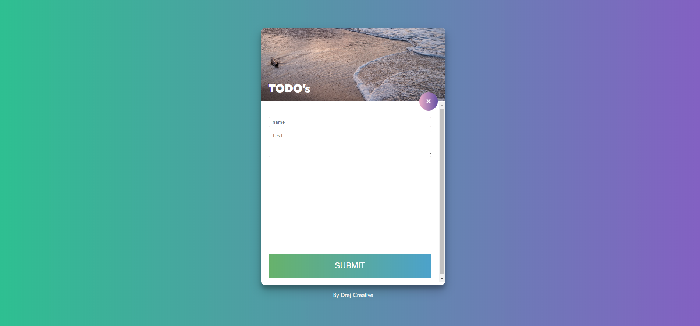

# MERN Stack starter

My personal MERN stack starter boilerplate, so I dont have to type it every time from scratch. It is optimized for React single page app, as if you would not use single page app then Next.je is better suggestion. I added simple but efective Todo app just to show all features annd to have setup and test all the routes, and react state management.

> Node, ExpressJs and MongoDB in backend.

> Frontend is latest React with Hooks, useContext with useReducer instead of Redux. Css Modules and css variables included.

## Install
Clone this project with `git clone https://github.com/drejcreative/mern-boilerplate-2020.git`

After it install all backend dependencies with `yarn`

Then run the same command in `client` folder to install all frontend dependencies 

## Development server
Change mongoDB url to your one in `config.env` file

Run `yarn run server` for a dev server. 

Run `npm run client` to start react app, or run `yarn start` in `client` folder.
It will automatically open your default browser and show the app. It has a live reload integrated.